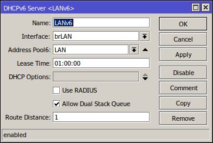
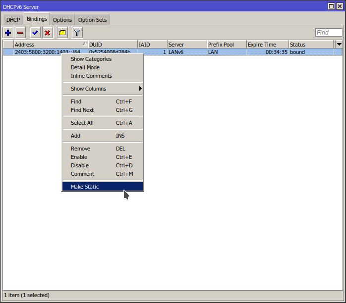
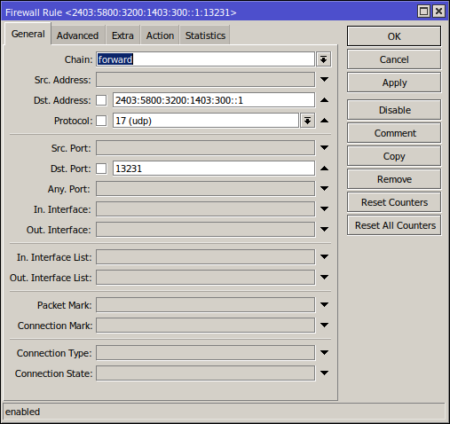
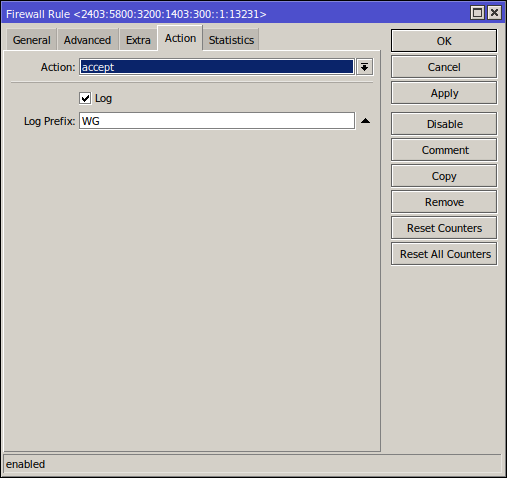
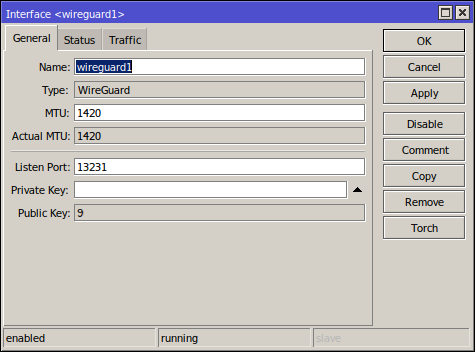
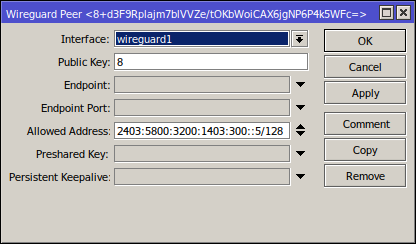
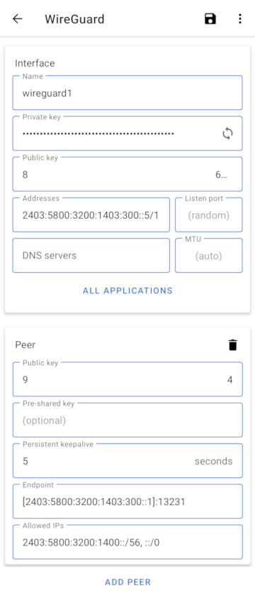

# RouterOS + Wireguard + Android
## Overview
This document is still a work in progress.

TODO:
- [ ] Write a better Intro/Overview
- [ ] Networking is *sometimes* broken if device is on home Wifi (i.e. same network as the Wireguard server)
- [ ] New screen shots that include the IPv4 settings in peer and client
- [ ] No support for IPv4 only mobile data/public Wifi networks
  - This might be forever impossible if the Wireguard router is behind CG-NAT
- [ ] Create a public DNS AAAA record for the RouterOS Peer
- [ ] Generally the language below is poor and could be improved
- [ ] Wireguard Peer screen shot contains the peer public key in the title bar

My goals are twofold:
* Secure remote access to services on my home network (without just allowing public internet access to said services)
* Route all traffic from my mobile device through my home ISP for privacy so
that, for example, a public open Wifi access point can be used without my data
being harvested.
* Bonus: once Wireguard infrastructure is in place, replace my existing OpenVPN
connections between my home and VPS networks.

I'm trying to make all parts of my network IPv6 native.  All devices that
support it are dual stack IPv4 and IPv6.  A failure to have fully working IPv6
connectivity over the VPN will be considered a failure.

My ISP provides an IPv6 /56 subnet and (at additional cost) a single static IPv4
address that is not behind CG-NAT.

With a little tinkering, my mobile data provider will assign my device a
single IPv6 address.  IPv4 connectivity id behind CG-NAT.

## Prerequisites
### RouterOS 7
Mikrotik RouterOS 7 is required as it is the first version of RouterOS to
support Wireguard.

At the time of writing, none of my Mikrotik hardware devices support RouterOS 7.
To work around this, I have created a dedicated Wireguard RouterOS instance in a
VM.

### Android: Wireguard client
<a href="https://play.google.com/store/apps/details?id=com.wireguard.android"></a>

or [Download from F-Droid](https://f-droid.org/en/packages/com.wireguard.android/)

### Accurate time
Wireguard complains if your peer clocks are a bit different.  Your mobile device
will probably keep itself up to date from the data network but your router might
benefit from having NTP configured and enabled.

```
/system ntp client
set enabled=yes
/system ntp client servers
add address=0.pool.ntp.org
```

## Addressing
### IPv4
We do need to be able to support legacy devices and systems and, if we're going
to use our home network ISP as the egress point for the mobile device's internet
access (see goal #2), we need to support the IPv4 only parts of the internet.

I picked two unused IPv4 subnets that I haven't used elsewhere (my network uses
several subnets):
* 172.31.4.128/26 (64 IPs): Will be assigned to Wireguard peers
* 172.31.4.192/26 (64 IPs): Routing between my core router and my wireguard
router.  This avoids asymmetric routing.  This is probably unnecessary if you
run Wireguard on your core router.
  * 172.31.4.193: The core router
  * 172.31.4.199: The Wireguard router via static DHCP assignment on the core
  router's DHCP server

### IPv6
We need to decide what virtual IP addresses to assign to the peer's wireguard
interfaces.

What I have implemented, is using IPs out of the prefix that was assigned to the
wireguard1 interface from DHCPv6.  The advantage being that everything on my
network knows how to route that prefix already and these IP addresses are real, globally routable IPs.

If a private IPv6 range was used (and these do exist) I imagine that NAT would
be required for the client devices to access the internet and RouterOS doesn't
currently support IPv6 NAT.

So, for me, my wireguard1 interface on my RouterOS VM is:
2403:5800:3200:1403:300::1 and I'm going to use 2403:5800:3200:1403:300::5 as
the first IP I assign to a device.

## RouterOS 7 VM
If you are using an existing device on your network, you probably don't need anything in this section.  Please skip ahead.

### On your core RouterOS router (the one that gets an IPv6 address and prefix from your ISP)

You will need your core router to be able to assign a subnet (or prefix) to the
RouterOS VM instance.

Assuming your DHCP client configuration is creating an address pool called
"LAN" and your LAN interface is called "brLAN" (which for me is a bridge between
two physical interfaces):



```
/ipv6 dhcp-server
add address-pool=LAN interface=brLAN lease-time=1h name=LANv6
```

The following will create a new IP pool for the small IPv4 subnet that will be
used for routing between the VM and the core network.  The same underlying
physical network will be used (brLAN, not a dedicated VLAN).
```
/ip pool
add name=dhcp-ISR2 ranges=172.31.4.194-172.31.4.199
/ip dhcp-server network
add address=172.31.4.192/26 comment=ISR2 dns-server=172.30.0.1 gateway=172.31.4.193
```
Assign an IP address in the new subnet to this core router:
```
/ip address
add address=172.31.4.193/26 interface=brLAN network=172.31.4.192
```
Assign a static lease to the VM so that it's IP is persistent:
```
/ip dhcp-server lease
add address=172.31.4.199 client-id=1:52:54:0:8d:28:4b mac-address=52:54:00:8D:28:4B server=dhcp-LAN
```
Setup a static route that points all traffic for the Wireguard clients (for
IPv4) to the VM.
```
/ip route
add check-gateway=ping distance=1 dst-address=172.31.4.128/26 gateway=172.31.4.199
```

### On the RouterOS VM
The VM should already be configured to get an IPv4 address, from the DHCP server
we configured above, for it's *ether1* interface.

For IPv6:


```
/ipv6 dhcp-client
add add-default-route=yes interface=ether1 pool-name=LAN pool-prefix-length=72 request=prefix use-interface-duid=yes
```
Once it says "Status: bound", it's working as expected.

### On your core RouterOS router
As super depressing as it is and as much as I hate to do it, we are going to be
hard coding some IPv6 IP addresses.  The DHCPv6 subnet we just assigned to the
VM is currently dynamic which means that it might change if the VM is restarted
(for example).  We will make it a static reservation on the DHCPv6 server (the
core router) so that it becomes persistent.



```
/ipv6 dhcp-server binding
add address=2403:5800:3200:1403::/64 duid=0x5254008d284b iaid=1 life-time=1h server=LANv6
```

Your core router should already be configured to be very restrictive as to the
inbound IPv6 traffic it allows through to your LAN (where the VM resides).  You
need to make a small hole for the Wireguard traffic to come in from the internet
and make it to your RouterOS VM.



```
/ipv6 firewall filter
add action=accept chain=forward comment="Wireguard listening port on isr2" dst-address=2403:5800:3200:1403:300::1/128 dst-port=13231 log=yes log-prefix=WG protocol=udp
```

## Public DNS record
Now that you have assigned a persistent IPv6 address that the devices will be connecting to, we can make some future steps a little easier by creating a
public DNS record that points to this address.

If you don't own a public DNS domain you can skip this step or look to some of
the free DNS record hosting solutions available (or just buy a cheap domain).

TODO

## Wireguard Terminology
Before we get into the wireguard setup itself, I found some of the fields in
both the Android client and the RouterOS configuration to be a little ambiguous.

### RouterOS: peer
* Allowed Address(es): This is NOT a list of public IP addresses that are
allowed to connect.  This is NOT a list of LAN IP addresses that the peer is
allowed to connect to.  This IS a list of LAN IP addresses ON THE PEER that are
allowed to send packets and have packets sent back to them.  This makes no sense
if the peer is a single device on a public network with a single IP but, when
you look at the android client, it will make more sense.

### Android: Interface
* Addresses: Not to be confused with the "Allowed IPs" field in the "Peer"
section.  This is a private IP address that will be assigned to the wireguard1
virtual network interface.  This is essentially a pretend LAN IP for the device
that isn't really on a LAN.  This field should match the "Allowed Address(es)"
field on the peer on the RouterOS end.

## Wireguard
When creating the Wireguard interface, leave the "Private Key" and "Public Key"
fields blank.  Keys will be generated when you save.

```
/interface wireguard
add listen-port=13231 mtu=1420 name=wireguard1 private-key="Ixxxxxxxxxxxxxxxxxxxxxxxxxxxxxxxxxxxxxxxxxx="
```

TODO: Screen shot of IPv6 Assignment
```
/ipv6 address
add address=::1/72 advertise=no from-pool=LAN interface=wireguard1
```

TODO: Screen shot of IPv4 Assignment
```
/ip address
add address=172.31.4.129/26 interface=wireguard1 network=172.31.4.128
```


```
/interface wireguard peers
add allowed-address=2403:5800:3200:1403:300::5/128,172.31.4.135/32 comment="Pixel 3 XL" interface=wireguard1 public-key="8yyyyyyyyyyyyyyyyyyyyyyyyyyyyyyyyyyyyyyyyyy="
```

## Android Client

